# Report - herring fish size data analysys
Marcin Berendt  
13 grudnia 2016  

1.Kod wyliczający wykorzystane biblioteki


```r
library(knitr, warn.conflicts = FALSE)
library(dplyr, warn.conflicts = FALSE)
library(ggplot2, warn.conflicts = FALSE)
library(shiny)

library(tidyverse)
```

```
## Loading tidyverse: tibble
## Loading tidyverse: tidyr
## Loading tidyverse: readr
## Loading tidyverse: purrr
```

```
## Conflicts with tidy packages ----------------------------------------------
```

```
## filter(): dplyr, stats
## lag():    dplyr, stats
```

```r
library(gplots)
```

```
## 
## Attaching package: 'gplots'
```

```
## The following object is masked from 'package:stats':
## 
##     lowess
```

```r
library(rpart)
library(randomForest)
```

```
## randomForest 4.6-12
```

```
## Type rfNews() to see new features/changes/bug fixes.
```

```
## 
## Attaching package: 'randomForest'
```

```
## The following object is masked from 'package:ggplot2':
## 
##     margin
```

```
## The following object is masked from 'package:dplyr':
## 
##     combine
```

```r
knitr::opts_chunk$set(echo = TRUE)
```

3.Kod pozwalający wczytać dane z pliku.


```r
sledzie <- read.csv("sledzie.csv")
```

4.Kod przetwarzający brakujące dane


5.Sekcję podsumowującą rozmiar zbioru i podstawowe statystyki

```r
knitr::kable(summary(sledzie))
```

           X             length         cfin1           cfin2            chel1            chel2            lcop1            lcop2            fbar             recr              cumf             totaln                   sst             sal            xmonth            nao         
---  --------------  -------------  --------------  --------------  ---------------  ---------------  ---------------  ---------------  ---------------  ----------------  ----------------  ----------------  --------------------  --------------  ---------------  -----------------
     Min.   :    0   Min.   :19.0   0      :14287   0.70118: 4374   11.5    : 4787   5.67765 : 4365   23      : 4787   9.17171 : 4370   Min.   :0.0680   Min.   : 140515   Min.   :0.06833   Min.   : 144137   13.6315997001: 4359   Min.   :35.40   Min.   : 1.000   Min.   :-4.89000 
     1st Qu.:13145   1st Qu.:24.0   0.02778: 2225   0      : 3806   2.46875 : 2241   21.67333: 3710   2.54787 : 2215   24.85867: 3709   1st Qu.:0.2270   1st Qu.: 360061   1st Qu.:0.14809   1st Qu.: 306068   14.0693330238: 3700   1st Qu.:35.51   1st Qu.: 5.000   1st Qu.:-1.89000 
     Median :26291   Median :25.5   1.02508: 2067   0.296  : 3706   12.15192: 2109   39.56809: 2101   12.49588: 2105   41.65566: 2102   Median :0.3320   Median : 421391   Median :0.23191   Median : 539558   14.4415996823: 2080   Median :35.51   Median : 8.000   Median : 0.20000 
     Mean   :26291   Mean   :25.3   1.21333: 1985   0.11736: 2106   6.42127 : 2062   26.81218: 2002   10.92857: 2059   45.70773: 1998   Mean   :0.3304   Mean   : 520367   Mean   :0.22981   Mean   : 514973   13.5598663683: 2010   Mean   :35.51   Mean   : 7.258   Mean   :-0.09236 
     3rd Qu.:39436   3rd Qu.:26.5   0.33333: 1914   4.55825: 2007   19.15475: 2001   15.03   : 1941   21.23147: 1979   17.68   : 1959   3rd Qu.:0.4560   3rd Qu.: 724151   3rd Qu.:0.29803   3rd Qu.: 730351   13.694933032 : 1950   3rd Qu.:35.52   3rd Qu.: 9.000   3rd Qu.: 1.63000 
     Max.   :52581   Max.   :32.5   0.11111: 1891   0.85684: 1665   9.66667 : 1926   9.43208 : 1661   27.33333: 1916   10.72889: 1676   Max.   :0.8490   Max.   :1565890   Max.   :0.39801   Max.   :1015595   13.861999695 : 1673   Max.   :35.61   Max.   :12.000   Max.   : 5.08000 
     NA              NA             (Other):28213   (Other):34918   (Other) :37456   (Other) :36802   (Other) :37521   (Other) :36768   NA               NA                NA                NA                (Other)      :36810   NA              NA               NA               

6.Szczegółową analizę wartości atrybutów 

```r
str(sledzie)
```

```
## 'data.frame':	52582 obs. of  16 variables:
##  $ X     : int  0 1 2 3 4 5 6 7 8 9 ...
##  $ length: num  23 22.5 25 25.5 24 22 24 23.5 22.5 22.5 ...
##  $ cfin1 : Factor w/ 40 levels "?","0","0.01",..: 5 5 5 5 5 5 5 5 5 5 ...
##  $ cfin2 : Factor w/ 49 levels "?","0","0.01",..: 14 14 14 14 14 14 14 14 14 14 ...
##  $ chel1 : Factor w/ 49 levels "?","0","0.2287",..: 20 20 20 20 20 20 20 20 20 20 ...
##  $ chel2 : Factor w/ 52 levels "?","10.10963",..: 1 23 23 23 23 23 23 23 23 23 ...
##  $ lcop1 : Factor w/ 49 levels "?","0.30741",..: 20 20 20 20 20 20 20 20 20 20 ...
##  $ lcop2 : Factor w/ 52 levels "?","10.72889",..: 23 23 23 23 23 1 23 23 23 23 ...
##  $ fbar  : num  0.356 0.356 0.356 0.356 0.356 0.356 0.356 0.356 0.356 0.356 ...
##  $ recr  : int  482831 482831 482831 482831 482831 482831 482831 482831 482831 482831 ...
##  $ cumf  : num  0.306 0.306 0.306 0.306 0.306 ...
##  $ totaln: num  267381 267381 267381 267381 267381 ...
##  $ sst   : Factor w/ 52 levels "?","12.7690663857",..: 38 38 38 38 38 38 38 38 38 38 ...
##  $ sal   : num  35.5 35.5 35.5 35.5 35.5 ...
##  $ xmonth: int  7 7 7 7 7 7 7 7 7 7 ...
##  $ nao   : num  2.8 2.8 2.8 2.8 2.8 2.8 2.8 2.8 2.8 2.8 ...
```

7.Sekcję sprawdzającą korelacje między zmiennymi; sekcja ta powinna zawierać jakąś formę graficznej prezentacji korelacji.


8.Interaktywny wykres lub animację prezentującą zmianę rozmiaru śledzi w czasie.

ggplot geom_bar 

```r
sledzie_asc_xmonth  <- arrange(sledzie, xmonth)

dsamp <- sledzie[sample(nrow(sledzie_asc_xmonth), 1000), ]

ggplot(sledzie_asc_xmonth, aes(x=xmonth, y=length)) + geom_bar(
  stat="identity",
  position=
      "identity")
```

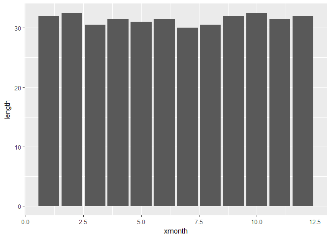<!-- -->


```r
# 3. wczytanie danych i 4. przetworzenie brakujących danych
sledzie <- read.csv("sledzie.csv", na.strings = "?")
# sledzie <- sledzie[, -1] # usuwam pierwszy wiersz z numeracja wierszy od 0 do n-1

# 5. rozmiar zbioru i statystyki
dim(sledzie)
```

```
## [1] 52582    16
```

```r
str(sledzie)
```

```
## 'data.frame':	52582 obs. of  16 variables:
##  $ X     : int  0 1 2 3 4 5 6 7 8 9 ...
##  $ length: num  23 22.5 25 25.5 24 22 24 23.5 22.5 22.5 ...
##  $ cfin1 : num  0.0278 0.0278 0.0278 0.0278 0.0278 ...
##  $ cfin2 : num  0.278 0.278 0.278 0.278 0.278 ...
##  $ chel1 : num  2.47 2.47 2.47 2.47 2.47 ...
##  $ chel2 : num  NA 21.4 21.4 21.4 21.4 ...
##  $ lcop1 : num  2.55 2.55 2.55 2.55 2.55 ...
##  $ lcop2 : num  26.4 26.4 26.4 26.4 26.4 ...
##  $ fbar  : num  0.356 0.356 0.356 0.356 0.356 0.356 0.356 0.356 0.356 0.356 ...
##  $ recr  : int  482831 482831 482831 482831 482831 482831 482831 482831 482831 482831 ...
##  $ cumf  : num  0.306 0.306 0.306 0.306 0.306 ...
##  $ totaln: num  267381 267381 267381 267381 267381 ...
##  $ sst   : num  14.3 14.3 14.3 14.3 14.3 ...
##  $ sal   : num  35.5 35.5 35.5 35.5 35.5 ...
##  $ xmonth: int  7 7 7 7 7 7 7 7 7 7 ...
##  $ nao   : num  2.8 2.8 2.8 2.8 2.8 2.8 2.8 2.8 2.8 2.8 ...
```

```r
summary(sledzie)
```

```
##        X             length         cfin1             cfin2        
##  Min.   :    0   Min.   :19.0   Min.   : 0.0000   Min.   : 0.0000  
##  1st Qu.:13145   1st Qu.:24.0   1st Qu.: 0.0000   1st Qu.: 0.2778  
##  Median :26291   Median :25.5   Median : 0.1111   Median : 0.7012  
##  Mean   :26291   Mean   :25.3   Mean   : 0.4458   Mean   : 2.0248  
##  3rd Qu.:39436   3rd Qu.:26.5   3rd Qu.: 0.3333   3rd Qu.: 1.7936  
##  Max.   :52581   Max.   :32.5   Max.   :37.6667   Max.   :19.3958  
##                                 NA's   :1581      NA's   :1536     
##      chel1            chel2            lcop1              lcop2       
##  Min.   : 0.000   Min.   : 5.238   Min.   :  0.3074   Min.   : 7.849  
##  1st Qu.: 2.469   1st Qu.:13.427   1st Qu.:  2.5479   1st Qu.:17.808  
##  Median : 5.750   Median :21.673   Median :  7.0000   Median :24.859  
##  Mean   :10.006   Mean   :21.221   Mean   : 12.8108   Mean   :28.419  
##  3rd Qu.:11.500   3rd Qu.:27.193   3rd Qu.: 21.2315   3rd Qu.:37.232  
##  Max.   :75.000   Max.   :57.706   Max.   :115.5833   Max.   :68.736  
##  NA's   :1555     NA's   :1556     NA's   :1653       NA's   :1591    
##       fbar             recr              cumf             totaln       
##  Min.   :0.0680   Min.   : 140515   Min.   :0.06833   Min.   : 144137  
##  1st Qu.:0.2270   1st Qu.: 360061   1st Qu.:0.14809   1st Qu.: 306068  
##  Median :0.3320   Median : 421391   Median :0.23191   Median : 539558  
##  Mean   :0.3304   Mean   : 520367   Mean   :0.22981   Mean   : 514973  
##  3rd Qu.:0.4560   3rd Qu.: 724151   3rd Qu.:0.29803   3rd Qu.: 730351  
##  Max.   :0.8490   Max.   :1565890   Max.   :0.39801   Max.   :1015595  
##                                                                        
##       sst             sal            xmonth            nao          
##  Min.   :12.77   Min.   :35.40   Min.   : 1.000   Min.   :-4.89000  
##  1st Qu.:13.60   1st Qu.:35.51   1st Qu.: 5.000   1st Qu.:-1.89000  
##  Median :13.86   Median :35.51   Median : 8.000   Median : 0.20000  
##  Mean   :13.87   Mean   :35.51   Mean   : 7.258   Mean   :-0.09236  
##  3rd Qu.:14.16   3rd Qu.:35.52   3rd Qu.: 9.000   3rd Qu.: 1.63000  
##  Max.   :14.73   Max.   :35.61   Max.   :12.000   Max.   : 5.08000  
##  NA's   :1584
```

```r
# sprawdz braki, ile ich jest
apply(sledzie, 2, function(x) sum(is.na(x)))
```

```
##      X length  cfin1  cfin2  chel1  chel2  lcop1  lcop2   fbar   recr 
##      0      0   1581   1536   1555   1556   1653   1591      0      0 
##   cumf totaln    sst    sal xmonth    nao 
##      0      0   1584      0      0      0
```

```r
# sprawdz braki, jaki procent
apply(sledzie, 2, function(x) sum(is.na(x))/length(x)) # ok 0,03%
```

```
##          X     length      cfin1      cfin2      chel1      chel2 
## 0.00000000 0.00000000 0.03006732 0.02921152 0.02957286 0.02959188 
##      lcop1      lcop2       fbar       recr       cumf     totaln 
## 0.03143661 0.03025750 0.00000000 0.00000000 0.00000000 0.00000000 
##        sst        sal     xmonth        nao 
## 0.03012438 0.00000000 0.00000000 0.00000000
```

```r
# czym zastapic braki? moze srednia?
sledzie <- data.frame(apply(sledzie, 2, function(x) {
  ind <- which(is.na(x))
  srednia <- mean(x, na.rm = TRUE)
  x[ind] <- srednia
  x
}))

# a moze pominac i uzyc complete obs przy cor() lub sledzie <- na.omit(sledzie)
sledzie <- na.omit(sledzie)


# 6. prezentacja rozkladow wartosci
for (i in colnames(sledzie)) {
  print(
    ggplot(data = sledzie,
           aes_string(
             x = i
           )) +
      geom_density(fill = "lightskyblue") +
      ggtitle(i)
  )
}
```

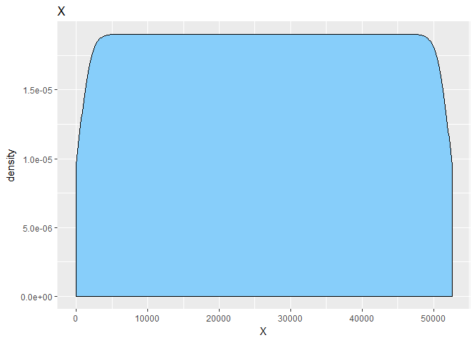<!-- -->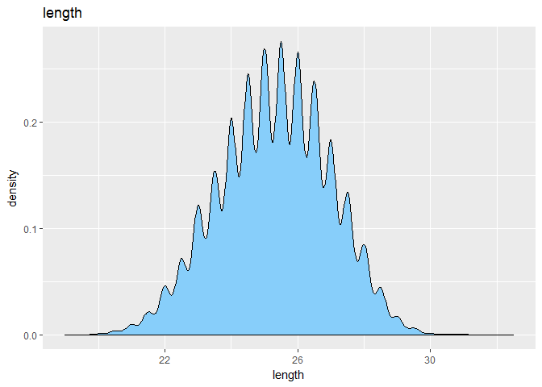<!-- -->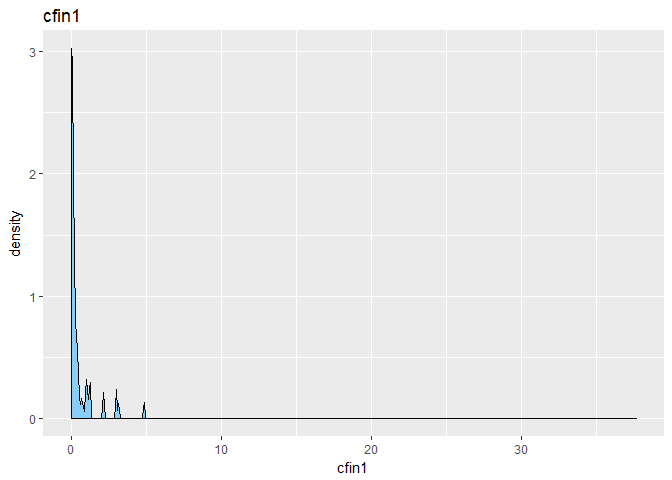<!-- -->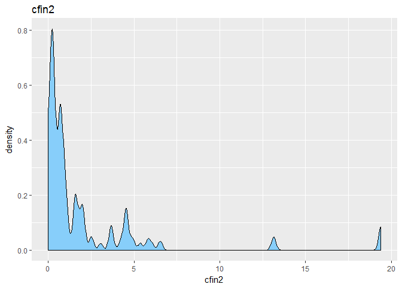<!-- -->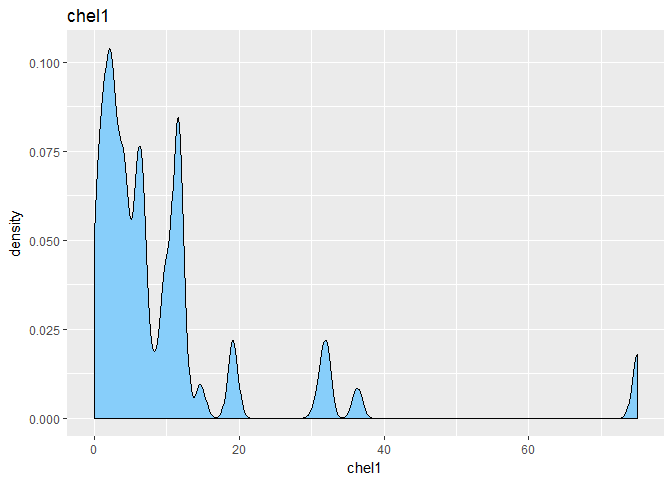<!-- -->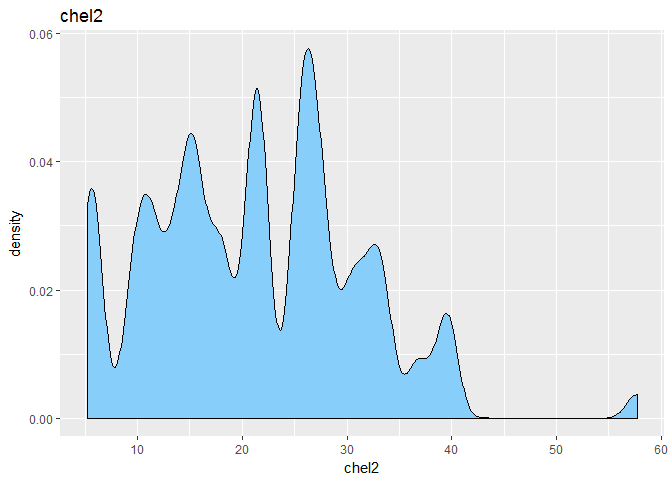<!-- -->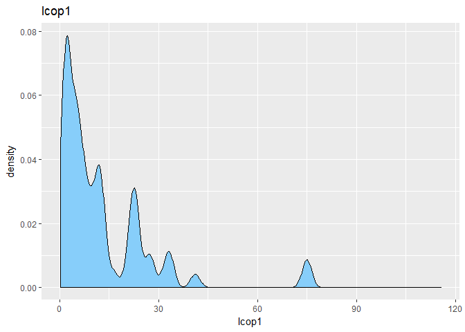<!-- -->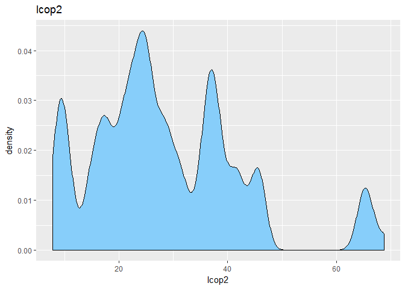<!-- -->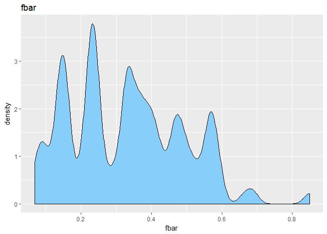<!-- -->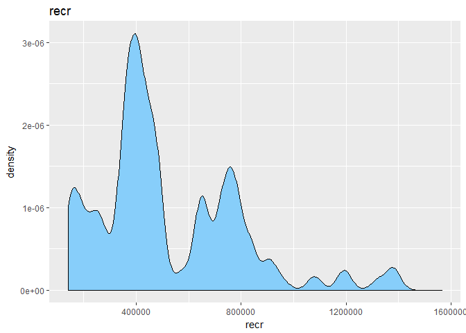<!-- -->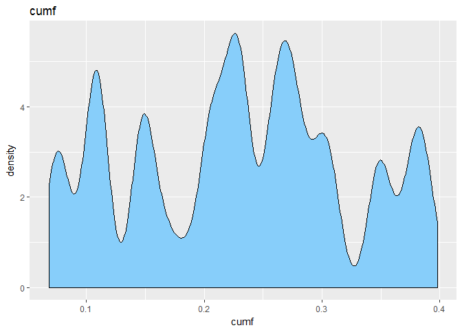<!-- -->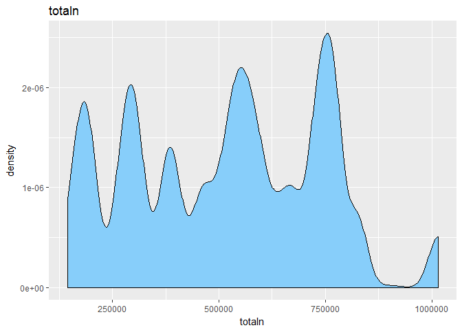<!-- -->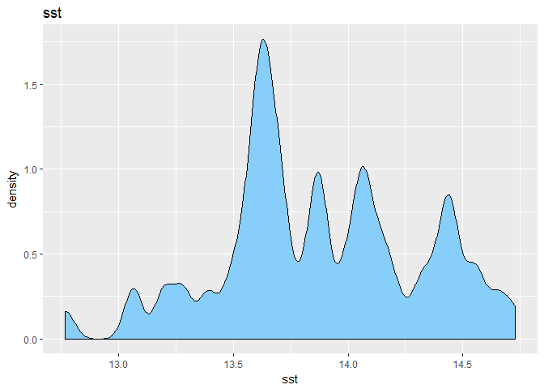<!-- -->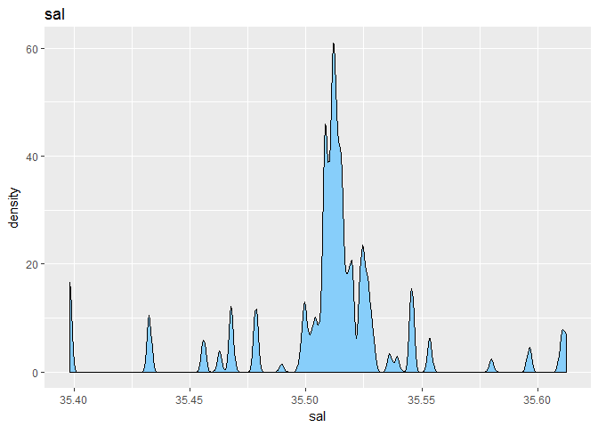<!-- -->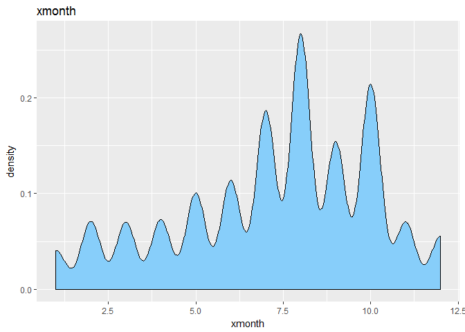<!-- -->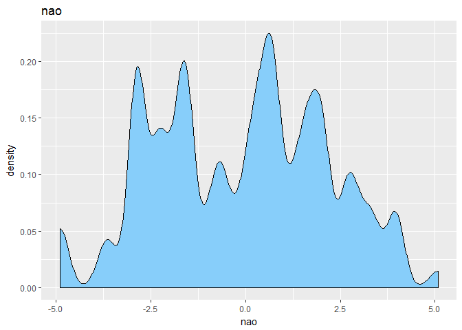<!-- -->

```r
# 7. korelacja miedzy zmiennymi
# zmienne oprocz length nie maja rozkladu normalnego wobec czego stosuje wspolczynnik korelacji spearmana
korelacja <- cor(sledzie, method = "spearman", use = "complete.obs")

my_palette <- colorRampPalette(c("green", "black", "red"))(n = 30)

# rysuje heatmape korelacji
heatmap.2(korelacja,
          col = my_palette,
          trace = "none",
          main = "Heatmapa korelacji",
          cellnote = round(korelacja, 2),
          notecol = "grey")
```

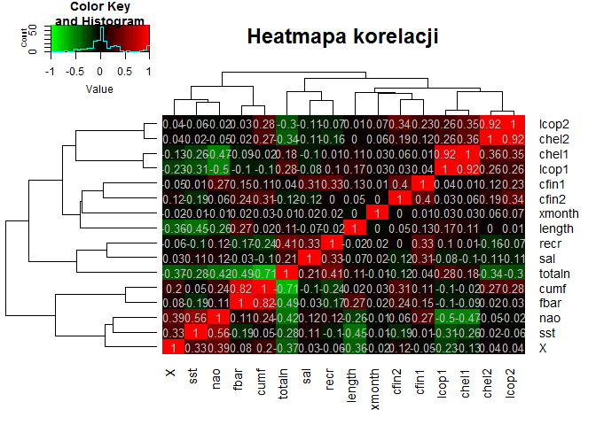<!-- -->

```r
# 8. interaktywny wykres lub animacja prezentujaca zmiane rozmiaru sledzi w czasie
# poki co wykres nieinteraktywny

ggplot(data = sledzie,
       aes(x = X,
           y = length)) +
  geom_point() +
  ggtitle("Wykres przedstawiajacy zmiane rozmiaru złowionego śledzia w czasie") +
  geom_smooth()
```

```
## `geom_smooth()` using method = 'gam'
```

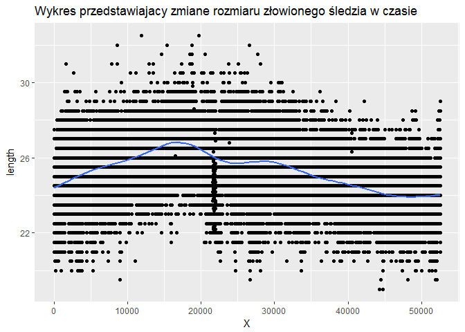<!-- -->

```r
# 9. regresor przewidujacy rozmiar sledzia
fit <- lm(length ~ ., data = sledzie)
summary(fit)
```

```
## 
## Call:
## lm(formula = length ~ ., data = sledzie)
## 
## Residuals:
##     Min      1Q  Median      3Q     Max 
## -6.2438 -0.8788  0.0154  0.9033  7.0308 
## 
## Coefficients:
##               Estimate Std. Error t value Pr(>|t|)    
## (Intercept)  8.105e+01  6.185e+00  13.103  < 2e-16 ***
## X           -2.402e-05  4.540e-07 -52.905  < 2e-16 ***
## cfin1        8.808e-02  6.805e-03  12.944  < 2e-16 ***
## cfin2        3.805e-02  2.946e-03  12.917  < 2e-16 ***
## chel1        2.967e-03  1.243e-03   2.386 0.017026 *  
## chel2       -3.135e-03  1.680e-03  -1.866 0.062013 .  
## lcop1        1.038e-02  1.159e-03   8.954  < 2e-16 ***
## lcop2        6.303e-03  1.377e-03   4.577 4.74e-06 ***
## fbar         6.172e+00  8.086e-02  76.331  < 2e-16 ***
## recr        -1.054e-07  2.753e-08  -3.828 0.000130 ***
## cumf        -1.026e+01  1.531e-01 -67.006  < 2e-16 ***
## totaln      -9.631e-07  5.093e-08 -18.908  < 2e-16 ***
## sst         -1.037e+00  1.985e-02 -52.258  < 2e-16 ***
## sal         -1.135e+00  1.751e-01  -6.478 9.35e-11 ***
## xmonth       7.446e-03  2.116e-03   3.518 0.000435 ***
## nao          5.747e-02  4.019e-03  14.297  < 2e-16 ***
## ---
## Signif. codes:  0 '***' 0.001 '**' 0.01 '*' 0.05 '.' 0.1 ' ' 1
## 
## Residual standard error: 1.332 on 52566 degrees of freedom
## Multiple R-squared:  0.351,	Adjusted R-squared:  0.3509 
## F-statistic:  1896 on 15 and 52566 DF,  p-value: < 2.2e-16
```

```r
# wyciagam R^2
summary(fit)$r.squared 
```

```
## [1] 0.3510424
```

```r
# Function that returns Root Mean Squared Error
rmse <- function(error)
{
  sqrt(mean(error^2))
}
rmse(fit$residuals)
```

```
## [1] 1.331495
```

```r
# drzewo regresyjne
fit2 <- rpart(length ~ ., data = sledzie, method = "anova")
printcp(fit2) # wyniki
```

```
## 
## Regression tree:
## rpart(formula = length ~ ., data = sledzie, method = "anova")
## 
## Variables actually used in tree construction:
## [1] cfin2 fbar  lcop1 lcop2 recr  sst   X    
## 
## Root node error: 143648/52582 = 2.7319
## 
## n= 52582 
## 
##         CP nsplit rel error  xerror      xstd
## 1 0.248756      0   1.00000 1.00004 0.0058277
## 2 0.075430      1   0.75124 0.75130 0.0045480
## 3 0.036726      2   0.67581 0.67587 0.0042899
## 4 0.035314      3   0.63909 0.64102 0.0041246
## 5 0.018808      4   0.60377 0.60571 0.0039736
## 6 0.012586      5   0.58497 0.58468 0.0038829
## 7 0.011233      6   0.57238 0.57216 0.0038167
## 8 0.010000      8   0.54991 0.55005 0.0036988
```

```r
plotcp(fit2) # wizualizacja cross-validation
```

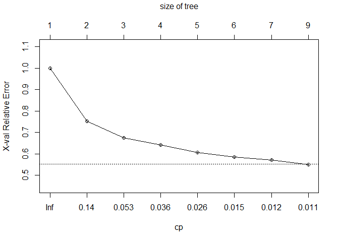<!-- -->

```r
print(fit2) # nudy
```

```
## n= 52582 
## 
## node), split, n, deviance, yval
##       * denotes terminal node
## 
##   1) root 52582 143648.100 25.30436  
##     2) sst>=14.10273 15191  30330.400 24.01103  
##       4) lcop2>=24.86266 8444  13285.410 23.48425 *
##       5) lcop2< 24.86266 6747  11769.330 24.67030  
##        10) cfin2< 0.29779 2040   2418.582 23.70907 *
##        11) cfin2>=0.29779 4707   6648.961 25.08689 *
##     3) sst< 14.10273 37391  77584.340 25.82980  
##       6) recr>=339431.5 29549  53605.030 25.55248  
##        12) lcop1< 25.16667 24497  41527.220 25.36432  
##          24) X>=39447.5 4354   5356.488 24.78000 *
##          25) X< 39447.5 20143  34362.770 25.49063  
##            50) fbar< 0.3225 13888  22799.350 25.31777  
##             100) X>=21197.5 6093   8476.809 24.90041 *
##             101) X< 21197.5 7795  12431.610 25.64400 *
##            51) fbar>=0.3225 6255  10227.110 25.87442 *
##        13) lcop1>=25.16667 5052   7005.014 26.46487 *
##       7) recr< 339431.5 7842  13143.980 26.87475 *
```

```r
summary(fit2) # podsumowanie splitow
```

```
## Call:
## rpart(formula = length ~ ., data = sledzie, method = "anova")
##   n= 52582 
## 
##           CP nsplit rel error    xerror        xstd
## 1 0.24875642      0 1.0000000 1.0000445 0.005827743
## 2 0.07542966      1 0.7512436 0.7513024 0.004547963
## 3 0.03672634      2 0.6758139 0.6758708 0.004289942
## 4 0.03531406      3 0.6390876 0.6410158 0.004124624
## 5 0.01880835      4 0.6037735 0.6057101 0.003973626
## 6 0.01258603      5 0.5849652 0.5846801 0.003882897
## 7 0.01123317      6 0.5723791 0.5721645 0.003816748
## 8 0.01000000      8 0.5499128 0.5500500 0.003698781
## 
## Variable importance
##    sst totaln   fbar      X    sal   recr  chel2    nao  lcop1  lcop2 
##     22     12     12     10      9      7      5      5      4      4 
##  cfin2  chel1   cumf 
##      4      3      1 
## 
## Node number 1: 52582 observations,    complexity param=0.2487564
##   mean=25.30436, MSE=2.731888 
##   left son=2 (15191 obs) right son=3 (37391 obs)
##   Primary splits:
##       sst   < 14.10273  to the right, improve=0.24875640, (0 missing)
##       X     < 38094.5   to the right, improve=0.18344510, (0 missing)
##       fbar  < 0.1395    to the left,  improve=0.10604880, (0 missing)
##       nao   < -0.855    to the right, improve=0.08071659, (0 missing)
##       lcop1 < 25.16666  to the left,  improve=0.08014126, (0 missing)
##   Surrogate splits:
##       fbar   < 0.1395    to the left,  agree=0.820, adj=0.379, (0 split)
##       X      < 44047.5   to the right, agree=0.808, adj=0.335, (0 split)
##       sal    < 35.45936  to the left,  agree=0.786, adj=0.259, (0 split)
##       totaln < 379691.5  to the left,  agree=0.759, adj=0.166, (0 split)
##       nao    < 3.69      to the right, agree=0.754, adj=0.150, (0 split)
## 
## Node number 2: 15191 observations,    complexity param=0.03672634
##   mean=24.01103, MSE=1.996603 
##   left son=4 (8444 obs) right son=5 (6747 obs)
##   Primary splits:
##       lcop2  < 24.86266  to the right, improve=0.1739400, (0 missing)
##       totaln < 306672    to the left,  improve=0.1735618, (0 missing)
##       chel2  < 19.91403  to the right, improve=0.1727151, (0 missing)
##       cfin1  < 0.15417   to the left,  improve=0.1443853, (0 missing)
##       cfin2  < 0.321045  to the left,  improve=0.1256592, (0 missing)
##   Surrogate splits:
##       chel2  < 19.91403  to the right, agree=0.974, adj=0.942, (0 split)
##       totaln < 304794.9  to the left,  agree=0.848, adj=0.657, (0 split)
##       chel1  < 2.09543   to the right, agree=0.769, adj=0.480, (0 split)
##       lcop1  < 2.345445  to the right, agree=0.769, adj=0.480, (0 split)
##       sst    < 14.44147  to the right, agree=0.748, adj=0.433, (0 split)
## 
## Node number 3: 37391 observations,    complexity param=0.07542966
##   mean=25.8298, MSE=2.074947 
##   left son=6 (29549 obs) right son=7 (7842 obs)
##   Primary splits:
##       recr   < 339431.5  to the right, improve=0.13965870, (0 missing)
##       X      < 34329.5   to the right, improve=0.09500444, (0 missing)
##       totaln < 435389    to the right, improve=0.09327126, (0 missing)
##       fbar   < 0.4925    to the left,  improve=0.08420007, (0 missing)
##       sal    < 35.50111  to the right, improve=0.07798737, (0 missing)
##   Surrogate splits:
##       totaln < 318217.9  to the right, agree=0.941, adj=0.721, (0 split)
##       sal    < 35.50111  to the right, agree=0.893, adj=0.490, (0 split)
##       fbar   < 0.4235    to the left,  agree=0.840, adj=0.236, (0 split)
##       chel2  < 27.17646  to the left,  agree=0.834, adj=0.208, (0 split)
##       nao    < -4.335    to the right, agree=0.832, adj=0.201, (0 split)
## 
## Node number 4: 8444 observations
##   mean=23.48425, MSE=1.573354 
## 
## Node number 5: 6747 observations,    complexity param=0.01880835
##   mean=24.6703, MSE=1.744379 
##   left son=10 (2040 obs) right son=11 (4707 obs)
##   Primary splits:
##       cfin2 < 0.29779   to the left,  improve=0.2295615, (0 missing)
##       X     < 44904.5   to the right, improve=0.2163490, (0 missing)
##       lcop2 < 19.04233  to the left,  improve=0.1755542, (0 missing)
##       chel2 < 13.07748  to the left,  improve=0.1669039, (0 missing)
##       cfin1 < 0.067135  to the left,  improve=0.1370563, (0 missing)
##   Surrogate splits:
##       X      < 44965     to the right, agree=0.894, adj=0.649, (0 split)
##       lcop2  < 19.04233  to the left,  agree=0.890, adj=0.637, (0 split)
##       chel2  < 13.07748  to the left,  agree=0.884, adj=0.618, (0 split)
##       totaln < 306672    to the left,  agree=0.853, adj=0.515, (0 split)
##       fbar   < 0.0905    to the left,  agree=0.836, adj=0.456, (0 split)
## 
## Node number 6: 29549 observations,    complexity param=0.03531406
##   mean=25.55248, MSE=1.814106 
##   left son=12 (24497 obs) right son=13 (5052 obs)
##   Primary splits:
##       lcop1 < 25.16666  to the left,  improve=0.09463290, (0 missing)
##       X     < 34329.5   to the right, improve=0.06611545, (0 missing)
##       chel1 < 24.99404  to the left,  improve=0.06490612, (0 missing)
##       recr  < 770538    to the left,  improve=0.04189560, (0 missing)
##       cfin2 < 0.25485   to the right, improve=0.03456548, (0 missing)
##   Surrogate splits:
##       chel1 < 24.99404  to the left,  agree=0.932, adj=0.604, (0 split)
##       cfin2 < 0.185265  to the right, agree=0.893, adj=0.376, (0 split)
##       sal   < 35.52679  to the left,  agree=0.856, adj=0.158, (0 split)
##       cfin1 < 3.988975  to the left,  agree=0.854, adj=0.144, (0 split)
##       chel2 < 41.6064   to the left,  agree=0.845, adj=0.093, (0 split)
## 
## Node number 7: 7842 observations
##   mean=26.87475, MSE=1.676101 
## 
## Node number 10: 2040 observations
##   mean=23.70907, MSE=1.18558 
## 
## Node number 11: 4707 observations
##   mean=25.08689, MSE=1.412569 
## 
## Node number 12: 24497 observations,    complexity param=0.01258603
##   mean=25.36432, MSE=1.695196 
##   left son=24 (4354 obs) right son=25 (20143 obs)
##   Primary splits:
##       X      < 39447.5   to the right, improve=0.04353674, (0 missing)
##       lcop1  < 0.94616   to the right, improve=0.02708282, (0 missing)
##       chel1  < 0.68475   to the right, improve=0.02263415, (0 missing)
##       cfin1  < 0.15417   to the left,  improve=0.02083335, (0 missing)
##       totaln < 771370    to the left,  improve=0.01861903, (0 missing)
##   Surrogate splits:
##       nao    < 2.36      to the right, agree=0.884, adj=0.348, (0 split)
##       recr   < 383015.5  to the left,  agree=0.863, adj=0.231, (0 split)
##       totaln < 379691.5  to the left,  agree=0.843, adj=0.118, (0 split)
##       chel2  < 37.1186   to the right, agree=0.840, adj=0.098, (0 split)
##       fbar   < 0.581     to the right, agree=0.839, adj=0.096, (0 split)
## 
## Node number 13: 5052 observations
##   mean=26.46487, MSE=1.386582 
## 
## Node number 24: 4354 observations
##   mean=24.78, MSE=1.230245 
## 
## Node number 25: 20143 observations,    complexity param=0.01123317
##   mean=25.49063, MSE=1.705941 
##   left son=50 (13888 obs) right son=51 (6255 obs)
##   Primary splits:
##       fbar  < 0.3225    to the left,  improve=0.03888828, (0 missing)
##       lcop1 < 6.458335  to the right, improve=0.03509955, (0 missing)
##       cumf  < 0.2317293 to the left,  improve=0.03229652, (0 missing)
##       chel1 < 6.68216   to the right, improve=0.02829071, (0 missing)
##       nao   < 0.53      to the left,  improve=0.02769956, (0 missing)
##   Surrogate splits:
##       nao    < 0.53      to the left,  agree=0.968, adj=0.898, (0 split)
##       cumf   < 0.2233902 to the left,  agree=0.964, adj=0.885, (0 split)
##       totaln < 557510.6  to the right, agree=0.939, adj=0.805, (0 split)
##       cfin2  < 0.77901   to the left,  agree=0.788, adj=0.316, (0 split)
##       recr   < 657843    to the left,  agree=0.788, adj=0.316, (0 split)
## 
## Node number 50: 13888 observations,    complexity param=0.01123317
##   mean=25.31777, MSE=1.641659 
##   left son=100 (6093 obs) right son=101 (7795 obs)
##   Primary splits:
##       X      < 21197.5   to the right, improve=0.08293823, (0 missing)
##       nao    < -2.87     to the right, improve=0.03244827, (0 missing)
##       recr   < 1286715   to the left,  improve=0.02964382, (0 missing)
##       totaln < 771370    to the left,  improve=0.02867062, (0 missing)
##       chel2  < 31.70569  to the left,  improve=0.02809056, (0 missing)
##   Surrogate splits:
##       cumf   < 0.1290849 to the right, agree=0.865, adj=0.693, (0 split)
##       fbar   < 0.214     to the right, agree=0.865, adj=0.691, (0 split)
##       totaln < 746717    to the left,  agree=0.862, adj=0.685, (0 split)
##       cfin2  < 0.62877   to the right, agree=0.852, adj=0.663, (0 split)
##       recr   < 413442.5  to the right, agree=0.802, adj=0.550, (0 split)
## 
## Node number 51: 6255 observations
##   mean=25.87442, MSE=1.635029 
## 
## Node number 100: 6093 observations
##   mean=24.90041, MSE=1.391237 
## 
## Node number 101: 7795 observations
##   mean=25.644, MSE=1.594818
```

```r
par(mfrow = c(1, 2))
rsq.rpart(fit2) # jak zmienia sie r^2 przy danej ilosci splitow
```

```
## 
## Regression tree:
## rpart(formula = length ~ ., data = sledzie, method = "anova")
## 
## Variables actually used in tree construction:
## [1] cfin2 fbar  lcop1 lcop2 recr  sst   X    
## 
## Root node error: 143648/52582 = 2.7319
## 
## n= 52582 
## 
##         CP nsplit rel error  xerror      xstd
## 1 0.248756      0   1.00000 1.00004 0.0058277
## 2 0.075430      1   0.75124 0.75130 0.0045480
## 3 0.036726      2   0.67581 0.67587 0.0042899
## 4 0.035314      3   0.63909 0.64102 0.0041246
## 5 0.018808      4   0.60377 0.60571 0.0039736
## 6 0.012586      5   0.58497 0.58468 0.0038829
## 7 0.011233      6   0.57238 0.57216 0.0038167
## 8 0.010000      8   0.54991 0.55005 0.0036988
```

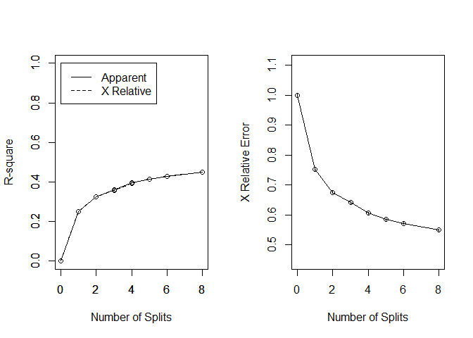<!-- -->

```r
par(mfrow = c(1, 1))
plot(fit2, uniform = TRUE, main = "Drzewo regresji dla rozmiaru poławianego śledzia")
text(fit2, use.n = TRUE, cex = 1)
```

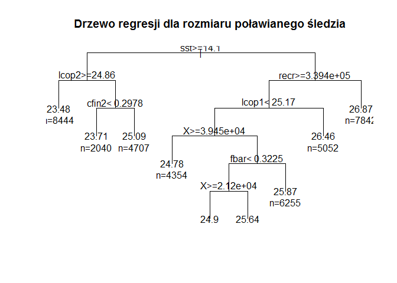<!-- -->

```r
# random forest
fit3 <- randomForest(length ~ ., data = na.omit(sledzie))
print(fit3)
```

```
## 
## Call:
##  randomForest(formula = length ~ ., data = na.omit(sledzie)) 
##                Type of random forest: regression
##                      Number of trees: 500
## No. of variables tried at each split: 5
## 
##           Mean of squared residuals: 1.140352
##                     % Var explained: 58.26
```

```r
waznosc <- importance(fit3)
waznosc <- data.frame(zmienna = rownames(waznosc), wartosc = waznosc[, 1])
waznosc$zmienna <- factor(waznosc$zmienna, levels = waznosc[order(waznosc$wartosc), "zmienna"])

ggplot(waznosc,
       aes(x = zmienna,
           y = wartosc)) +
  geom_bar(stat = "identity") +
  coord_flip() +
  ggtitle("Waznosc zmiennych dla randomForest")
```

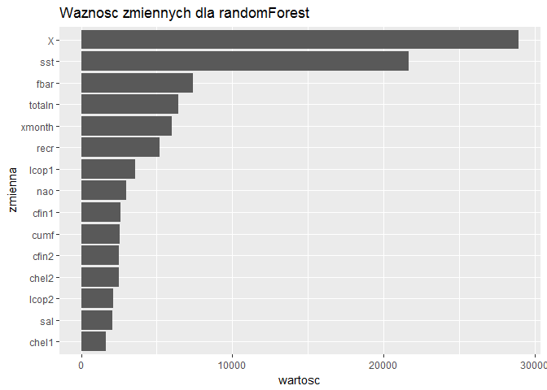<!-- -->

```r
# najwazniejsza zmienna sst
# rysuje scatterplot
ggplot(data = sledzie,
       aes(x = length,
           y = sst)) +
  geom_point() +
  geom_smooth(method = "lm")
```

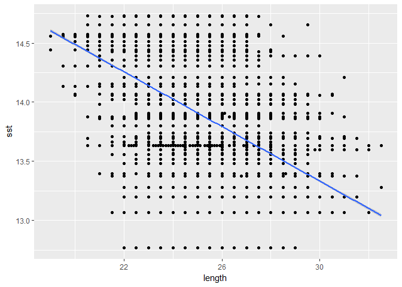<!-- -->

```r
cor.test(sledzie$length, sledzie$sst)
```

```
## 
## 	Pearson's product-moment correlation
## 
## data:  sledzie$length and sledzie$sst
## t = -113.97, df = 52580, p-value < 2.2e-16
## alternative hypothesis: true correlation is not equal to 0
## 95 percent confidence interval:
##  -0.4518957 -0.4381871
## sample estimates:
##        cor 
## -0.4450675
```
